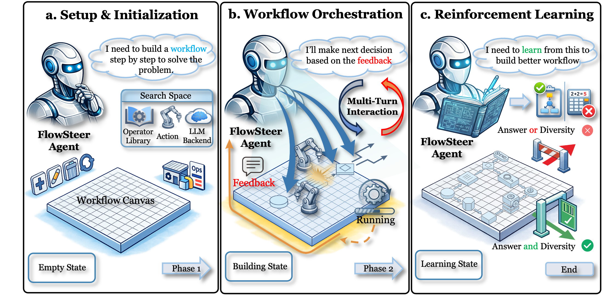
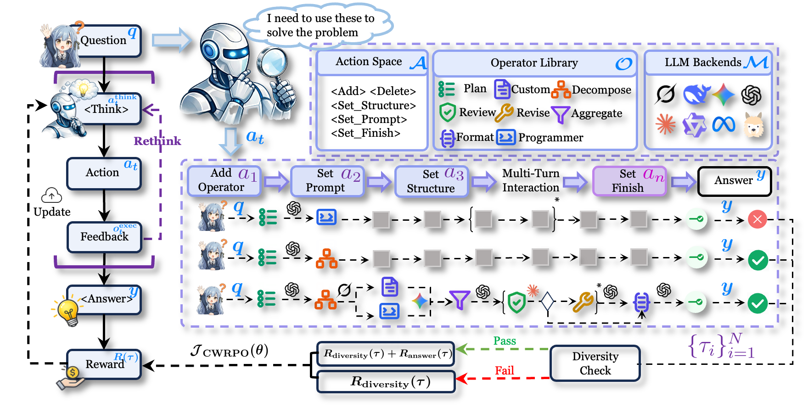
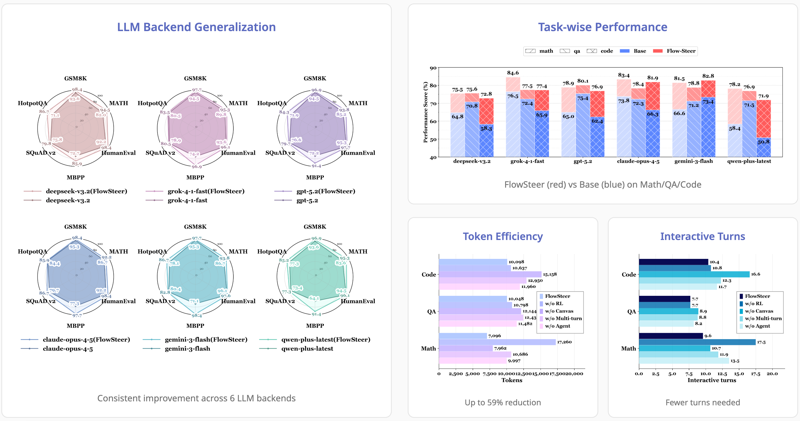

# FlowSteer: Interactive Agentic Workflow Orchestration via End-to-End Reinforcement Learning

<div align="center">

[](http://flowsteer.org/)
[](http://flowsteer.org/demo/)
[](http://flowsteer.org/paper.pdf)
[](https://anonymous.4open.science/r/FlowSteer-9B2E)
[](https://huggingface.co/beita6969/FlowSteer-8b)
[](https://huggingface.co/datasets/beita6969/FlowSteer-Dataset)

### **FlowSteer**: End-to-End RL Framework for Automated Workflow Orchestration

</div>

---

## Overview

<div align="center">
  
</div>

**FlowSteer** addresses critical challenges in agentic workflow orchestration—high manual cost, reliance on specific operators/LLMs, and sparse reward signals. **FlowSteer** is an **end-to-end reinforcement learning (RL)** framework that takes a lightweight policy model as the agent and an executable canvas environment, automating workflow orchestration through **multi-turn interaction**. In this process, the policy model analyzes execution states and selects editing actions, while the canvas executes operators and returns feedback for iterative refinement.

<div align="center">
  
</div>

By integrating **Canvas Workflow Relative Policy Optimization (CWRPO)** with diversity-constrained rewards, **FlowSteer** offers a **plug-and-play framework** that supports diverse operator libraries and interchangeable LLM backends.

## Key Features

- **End-to-End RL Training**: Learns workflow orchestration through real execution feedback
- **Plug-and-Play Design**: Supports diverse operator libraries and interchangeable LLM backends
- **CWRPO Algorithm**: Novel training algorithm with diversity-constrained rewards and conditional release
- **Multi-Turn Interaction**: Iteratively builds and refines workflows through canvas environment

## Results

<div align="center">
  
</div>

## Project Structure

```
flowsteer/
├── train_interactive.py          # Main training script
├── eval_only.py                  # Evaluation script
├── merge_and_upload.py           # Model merge and upload utility
├── config/
│   ├── training_interactive.yaml # Training configuration
│   ├── datasets.yaml             # Dataset configuration
│   └── operator.json             # Operator definitions
├── data/
│   ├── train_balanced_12k_humaneval36_fixed.jsonl  # Training data
│   └── test_balanced_768_no_overlap.jsonl          # Test data
├── scripts/
│   ├── operators.py              # Workflow operators
│   └── prompts/                  # Prompt templates
└── src/
    └── interactive/              # Core interactive training modules
        ├── workflow_env.py       # Workflow environment
        ├── cwrpo_trainer.py      # CWRPO trainer
        ├── action_parser.py      # Action parsing
        └── trajectory_reward.py  # Reward computation
```

## Requirements

- Python 3.10+
- CUDA 11.8+
- GPU: NVIDIA A100 80GB (recommended) or RTX 3090 24GB
- Memory: 64GB+

## Quick Start

### 1. Install Environment

```bash
conda create -n flowsteer python=3.10 -y
conda activate flowsteer
pip install -r requirements.txt
pip install vllm>=0.6.0
```

### 2. Download Base Model

```bash
# Using huggingface
huggingface-cli download Qwen/Qwen3-8B

# Or using modelscope
pip install modelscope
python -c "from modelscope import snapshot_download; snapshot_download('Qwen/Qwen3-8B')"
```

### 3. Start vLLM Server

```bash
CUDA_VISIBLE_DEVICES=0 python -m vllm.entrypoints.openai.api_server \
    --model /path/to/Qwen3-8B \
    --served-model-name Qwen3-8B \
    --port 8003 \
    --gpu-memory-utilization 0.85 \
    --max-model-len 16384 \
    --enable-lora \
    --max-loras 2 \
    --max-lora-rank 64 \
    --trust-remote-code \
    --dtype bfloat16
```

### 4. Start Training

```bash
CUDA_VISIBLE_DEVICES=2 python train_interactive.py \
    --config config/training_interactive.yaml
```

### 5. Evaluation

```bash
python eval_only.py --config config/training_interactive.yaml \
    --checkpoint checkpoints/interactive/checkpoint_step_100
```

## Configuration

Edit `config/training_interactive.yaml`:

```yaml
# Model configuration
base_model: "/path/to/Qwen3-8B"
vllm_base_url: "http://localhost:8003/v1"

# Training parameters
learning_rate: 1.0e-5
samples_per_source: 6
max_steps: 300

# LoRA configuration
use_lora: true
lora_rank: 64
lora_alpha: 64
```

## License

This project is for research purposes.
