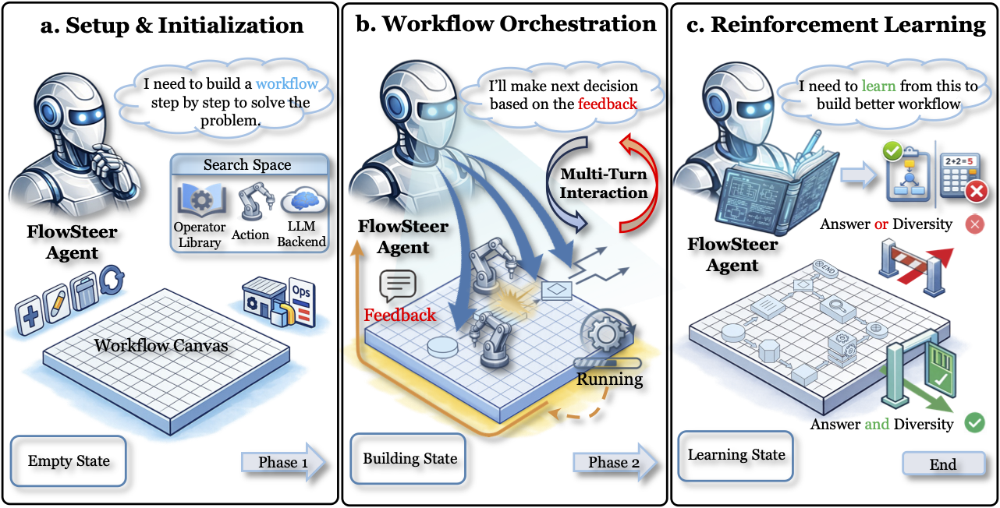
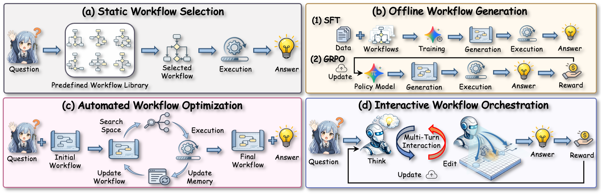
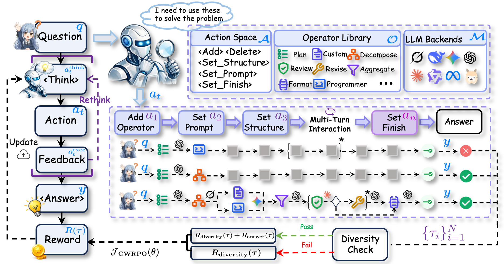
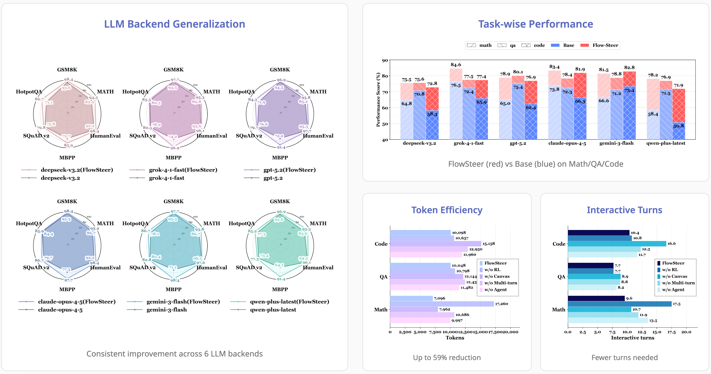
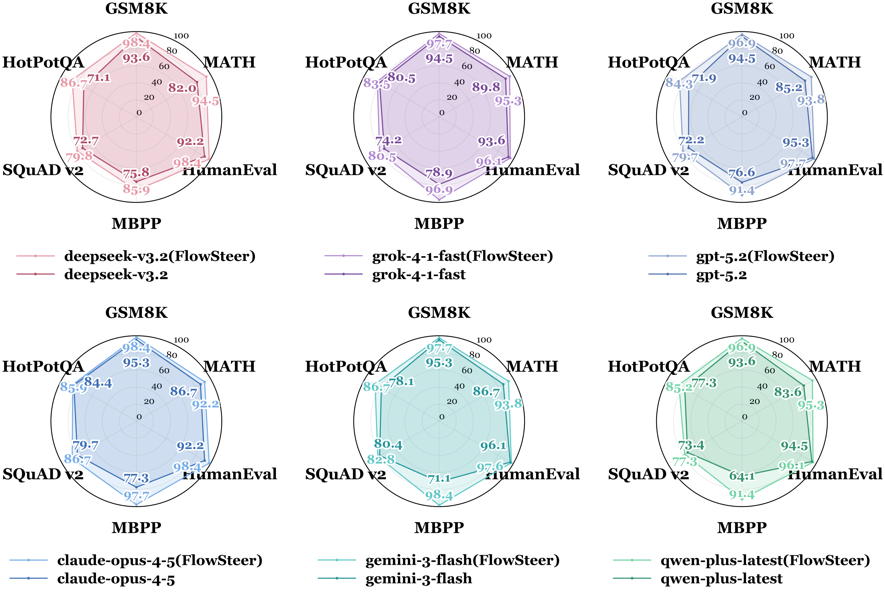
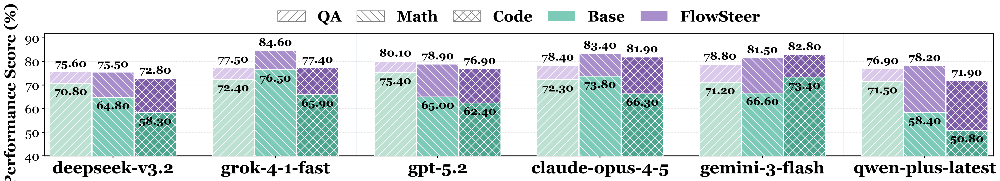
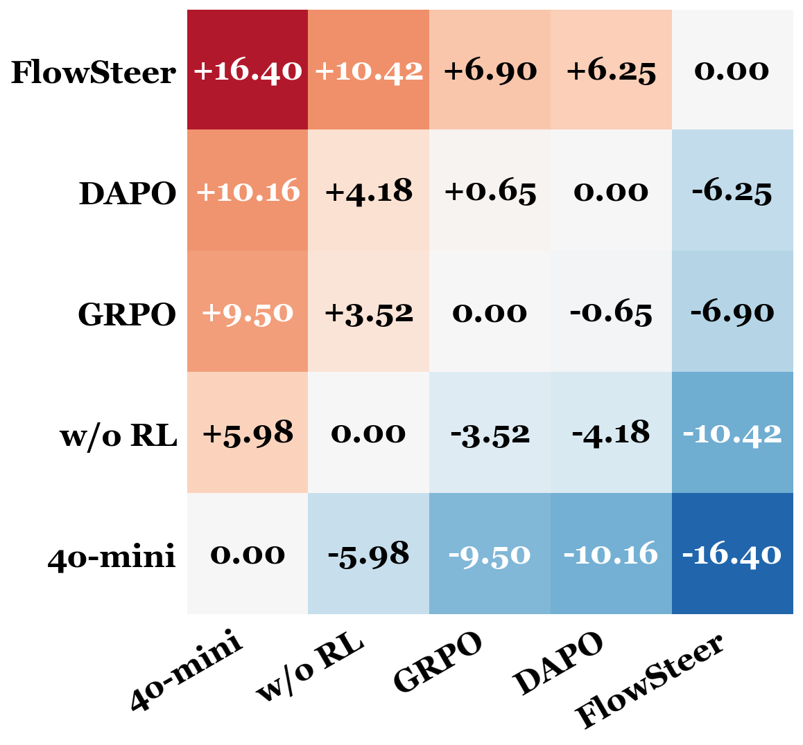
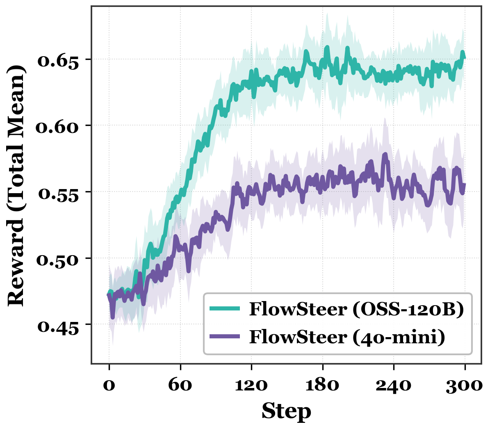
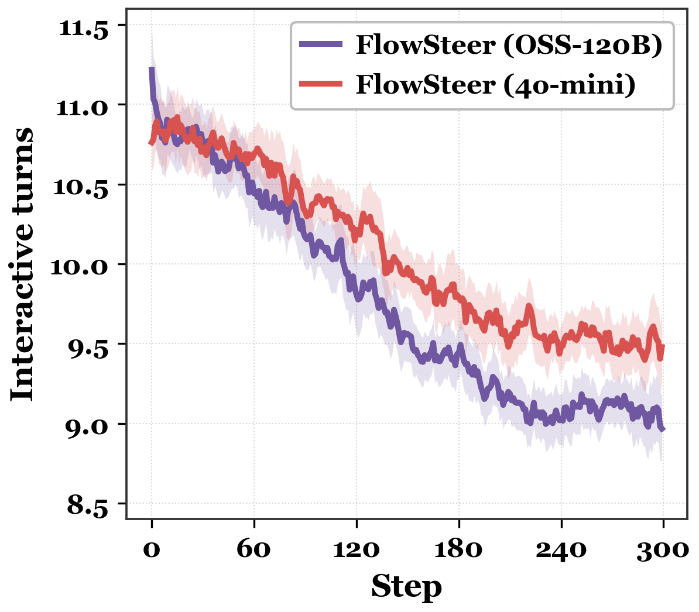
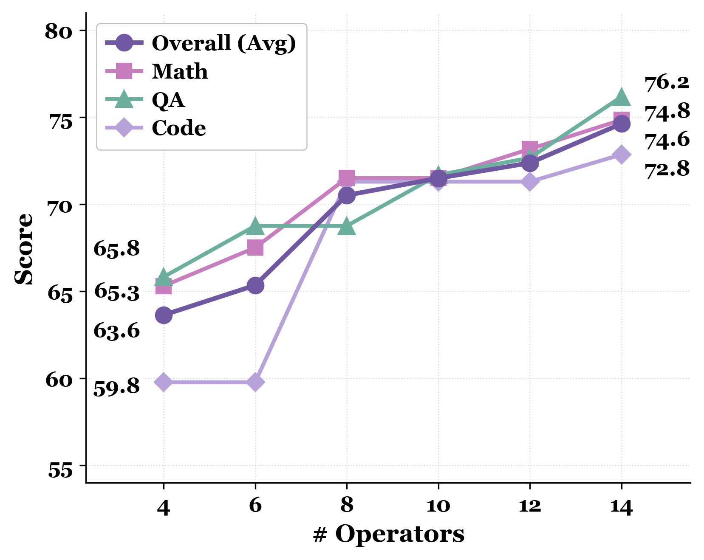

# FlowSteer: Towards Agents Designing Agentic Workflows via Reinforced Progressive Canvas Editing

<div align="center">

[](http://flowsteer.org/)
[](http://flowsteer.org/demo/)
[](https://arxiv.org/abs/2602.01664)
[](https://huggingface.co/beita6969/FlowSteer-8b)
[](https://huggingface.co/datasets/beita6969/FlowSteer-Dataset)

### Agent Designing Agentic Workflows with an executable Workflow Canvas



</div>

## Overview

FlowSteer studies **Agent Designing Agentic Workflows**: a lightweight Flow-Director designs an executable workflow graph, while a pluggable executor LLM runs the designed workflow to solve the task. The framework combines an executable Workflow Canvas, designer--executor decoupling, and reinforcement learning over multi-turn canvas editing.

## Visual Summary

<table>
<tr>
<td width="50%" align="center">
  <br>
  <sub>Workflow orchestration paradigms</sub>
</td>
<td width="50%" align="center">
  <br>
  <sub>FlowSteer framework</sub>
</td>
</tr>
</table>

## Results and Diagnostics

<div align="center">
  <br>
  <sub>Main results on IID and OOD benchmarks</sub>
</div>

<br>

<table>
<tr>
<td width="33%" align="center"><br><sub>Backend transfer</sub></td>
<td width="33%" align="center"><br><sub>Training dynamics</sub></td>
<td width="33%" align="center"><br><sub>RL comparison</sub></td>
</tr>
<tr>
<td width="33%" align="center"><br><sub>Reward scaling</sub></td>
<td width="33%" align="center"><br><sub>Interaction turns</sub></td>
<td width="33%" align="center"><br><sub>Scaling analysis</sub></td>
</tr>
</table>

## Repository Layout

```text
train_interactive.py              training entry point for multi-turn canvas editing
eval_only.py                      inference/evaluation entry point
merge_and_upload.py               LoRA merge and upload utility
config/training_interactive.yaml  paper-aligned training configuration
config/aflow_llm.yaml.example     executor backend configuration template
config/operator.json              operator descriptions
scripts/operators.py              operator implementations
src/interactive/workflow_env.py   Workflow Canvas environment
src/interactive/workflow_graph.py graph state and structure checks
src/interactive/action_parser.py  XML/action parsing
src/interactive/grpo_trainer.py   GRPO utilities
src/interactive/trajectory_reward.py diversity-gated reward
figs/                             figures synchronized with the arXiv v4 manuscript
```

## Requirements

- Python 3.10+
- CUDA-capable GPU
- vLLM with LoRA serving enabled
- A local or API executor backend configured through `config/aflow_llm.yaml`

The paper experiments use Qwen3-8B as the Flow-Director policy model, LoRA fine-tuning, bfloat16 precision, and a GPT-OSS-120B executor backend.

## Installation

```bash
git clone https://github.com/beita6969/FlowSteer.git
cd FlowSteer

conda create -n flowsteer python=3.10 -y
conda activate flowsteer
pip install -r requirements.txt
pip install "vllm>=0.6.0"
```

## Dataset

The hosted dataset can be downloaded from Hugging Face:

```bash
python - <<'PY'
from huggingface_hub import snapshot_download

snapshot_download(
    repo_id="beita6969/FlowSteer-Dataset",
    repo_type="dataset",
    local_dir="data",
    allow_patterns=["train/train_12k.jsonl", "eval/*.jsonl"],
    endpoint="https://huggingface.co",
)
PY
```

The paper evaluates 12 datasets: six IID datasets for training/testing and six OOD datasets for generalization.

```text
IID: GSM8K, MATH, HotPotQA, SQuAD v2, MBPP, HumanEval
OOD: TriviaQA, NaturalQuestions, MathQA, AIME 2025, APPS, DS-1000
```

The arXiv v4 appendix specifies the paper training recipe as 10,778 IID training instances: 2,560 each from GSM8K, MATH, HotPotQA, and SQuAD v2, plus 374 MBPP and 164 HumanEval examples. The public dataset repository also provides evaluation JSONL files under `data/eval/` for the 12 benchmark families.

## Configure Executor Backend

Create the executor configuration from the template:

```bash
cp config/aflow_llm.yaml.example config/aflow_llm.yaml
```

For an OpenAI-compatible local executor service, set:

```yaml
models:
  gpt-oss-120b:
    api_type: openai
    base_url: http://127.0.0.1:8004/v1
    api_key: EMPTY
    model_name: gpt-oss-120b
    temperature: 0
    top_p: 1
    max_tokens: 4096
```

Then ensure `config/training_interactive.yaml` points to the same executor model name:

```yaml
aflow_executor_model: "gpt-oss-120b"
```

## Start Flow-Director vLLM Service

```bash
CUDA_VISIBLE_DEVICES=0 python -m vllm.entrypoints.openai.api_server \
  --model /path/to/Qwen3-8B \
  --served-model-name Qwen3-8B \
  --port 8003 \
  --gpu-memory-utilization 0.85 \
  --max-model-len 16384 \
  --enable-lora \
  --max-loras 2 \
  --max-lora-rank 64 \
  --trust-remote-code \
  --dtype bfloat16
```

## Training

```bash
CUDA_VISIBLE_DEVICES=0 python train_interactive.py \
  --config config/training_interactive.yaml
```

Important paper-aligned defaults are already set in `config/training_interactive.yaml`:

| Category | Setting |
| --- | --- |
| Policy model | Qwen3-8B |
| LoRA | rank 64, alpha 64, dropout 0.05, q/k/v/o projections |
| RL objective | GRPO with canvas token mask |
| Samples per group | 36 |
| Clip / KL | 0.20 / 0.005 |
| Generation | temperature 0.6, top-p 0.95, top-k 20, max new tokens 2048 |
| Interaction | max 20 rounds |
| Reward | base -1.0, diversity cap 1.0, correctness released only after full structural reward |
| Executor timeout | 600 seconds |

## Evaluation

Evaluate a single benchmark file:

```bash
python eval_only.py \
  --config config/training_interactive.yaml \
  --data data/eval/gsm8k.jsonl \
  --num-samples 128 \
  --workers 16
```

Evaluate with a served LoRA adapter by starting vLLM with the adapter first, then passing the served adapter name:

```bash
python eval_only.py \
  --config config/training_interactive.yaml \
  --data data/eval/humaneval.jsonl \
  --vllm-model flowsteer-adapter \
  --workers 16
```

`--checkpoint` is recorded for diagnosis only; the adapter must already be loaded by the vLLM server.

## Model Weights

The released Flow-Director model is hosted at:

```text
https://huggingface.co/beita6969/FlowSteer-8b
```

## License

This repository is released for research use. Please also follow the licenses and terms of the upstream models, datasets, and benchmark suites used with FlowSteer.
